# METArt

`#메타버스` `#NFT` `#전시` 

## Introduction

Notion: [link](https://dev-junyong.notion.site/METArt-42be9a8ca55f41a1b15365b2d5ac0a17)

주제: NFT 작품을 거래하기 위한 메타버스 전시 서비스

-  삼성 청년 소프트웨어 아카데미(SSAFY) 자율 프로젝트
-  누구나 아티스트가 되어 NFT를 등록, 거래, 전시할 수 있는 서비스
-  (주요기능) 작품 등록, 작품 거래, 메타버스 전시관, 갤러리  

[배포 서버 URL](https://k6d106.p.ssafy.io/)

## Tech Stack

#### Frontend

* React.js 18.1.0
* next.js 21.1.5 
* Material-UI 
* Web3.js 1.7.3
* Metamask 
* ESLint 8.6.0 
* Prettier 2.6.2 
* Visual Studio Code  

#### Backend

* Maven 3.8.4 
* Java 11
* Spring-boot 2.6.7 
* Web3.j 
* Spring Data JPA 
* QueryDSL 
* IntelliJ IDEA 
* Postman

#### Unity

* Unity 2020.3.33f1 
* Photon 2.4
* WebGL 2.0

#### Smart Contract

* Solidity 0.8.4 
* Truffle 
* Ethereum rinkeby testnet 
* Ganache
* Visual Studio Code

#### Database

* Mysql

#### CI/CD

* Jenkins 
* GitLab

#### Project Magangement

* GitLab 
* Mattermost 
* Jira 
* Notion

## Result

1. Main

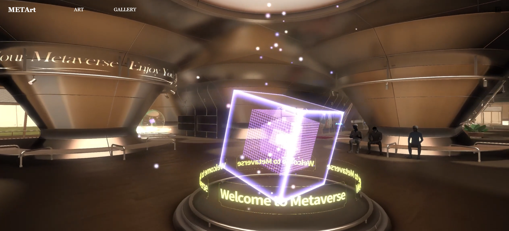

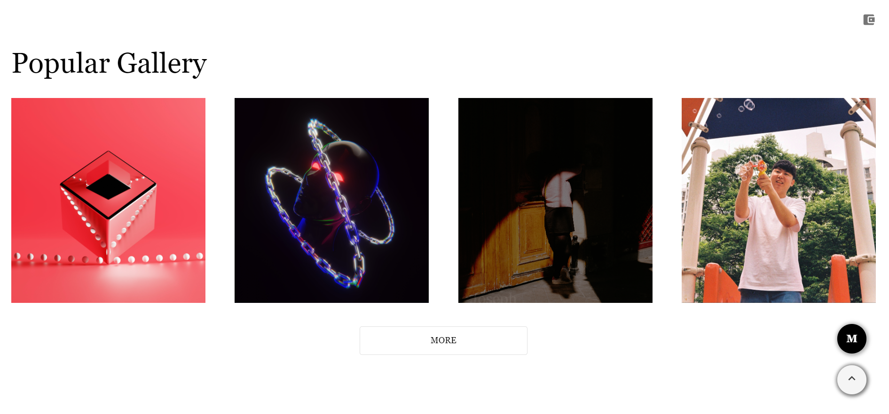

2. Art

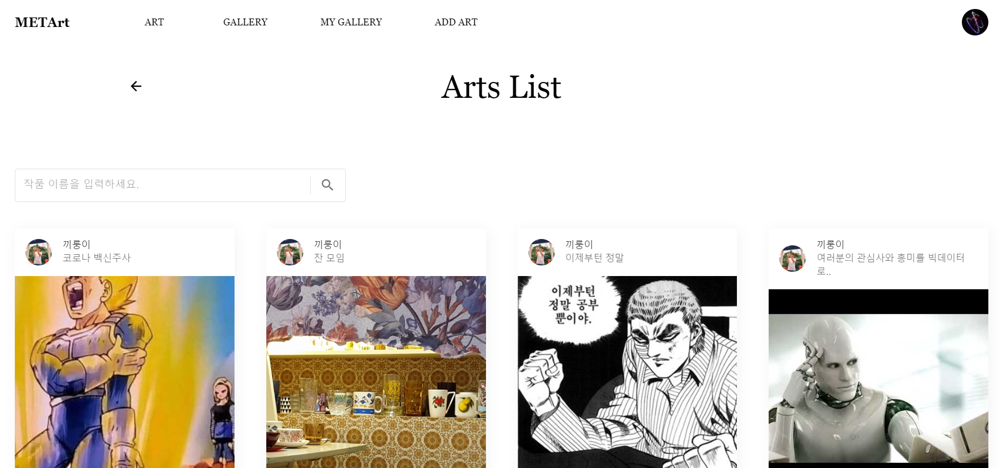

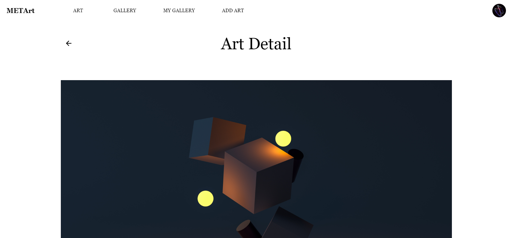

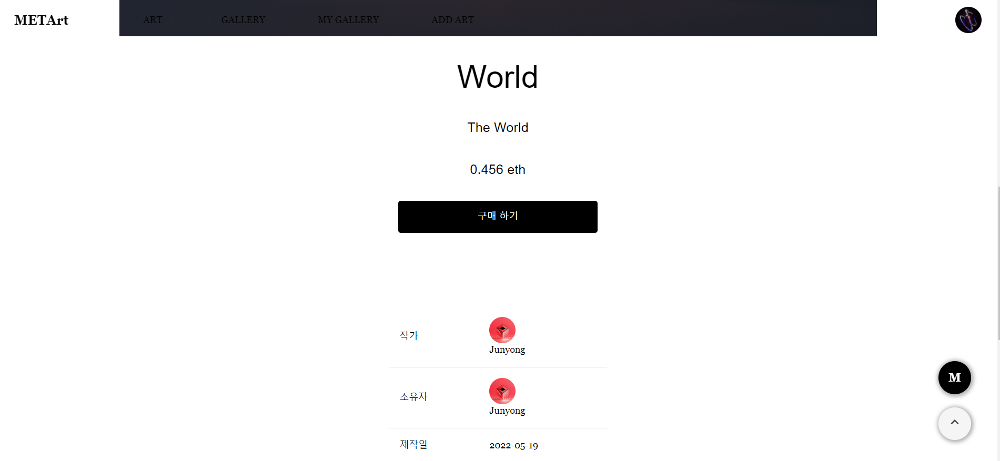

3. Gallery

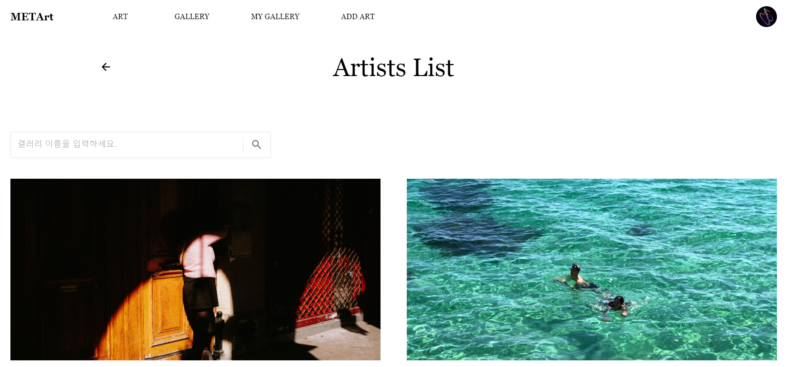

4. Gallery

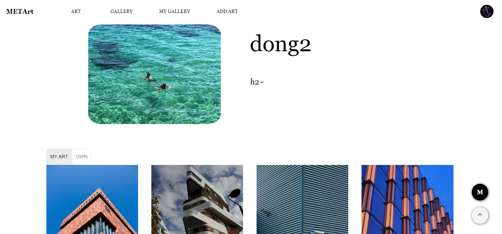

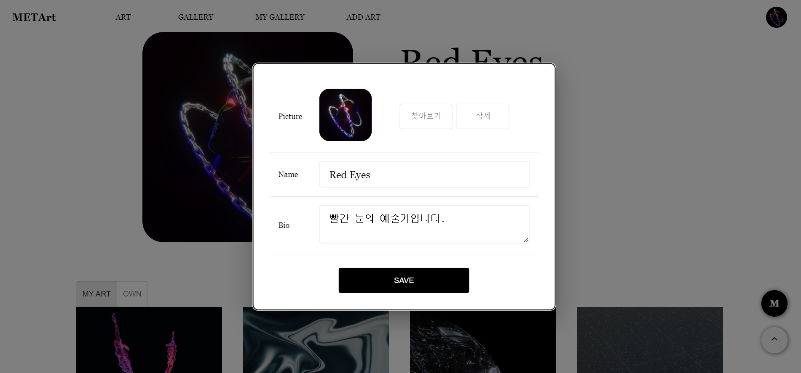

5. Add Art

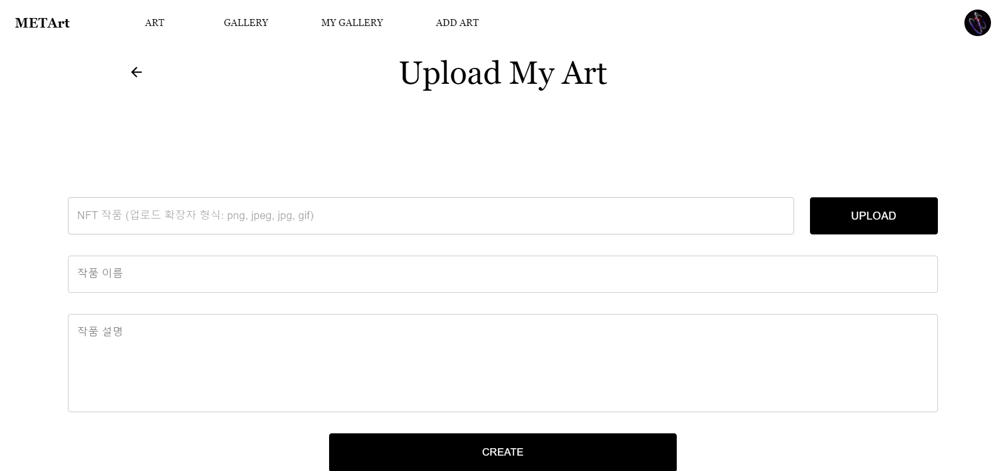

5. Meta art

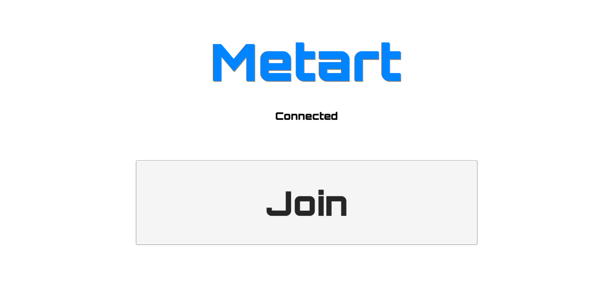

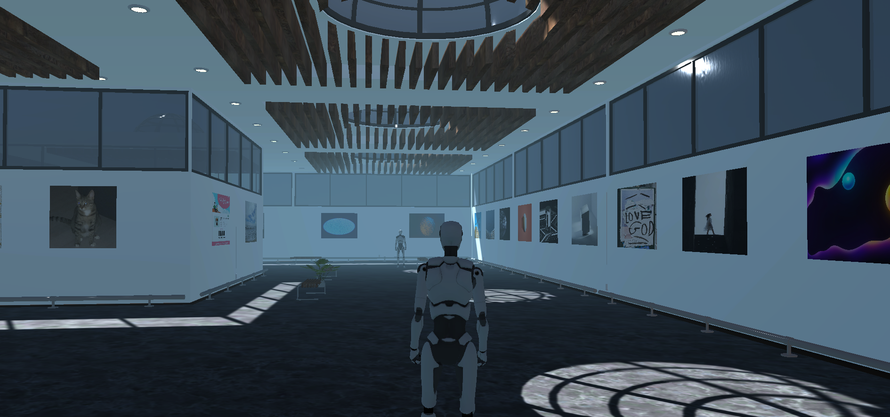

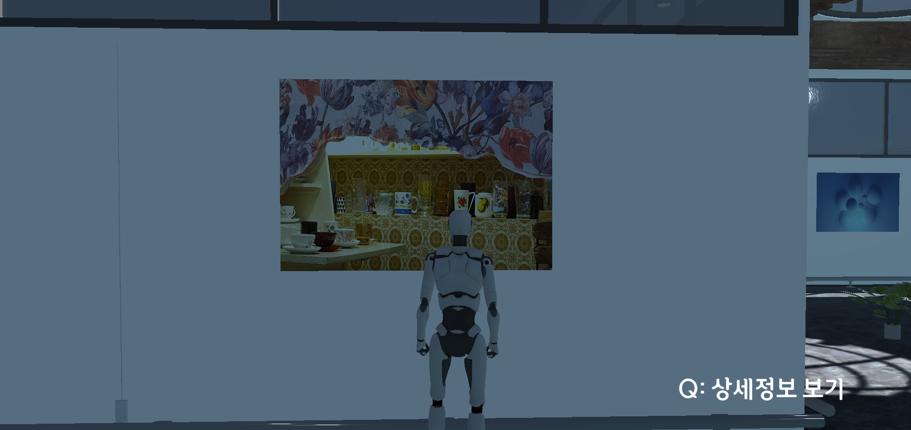

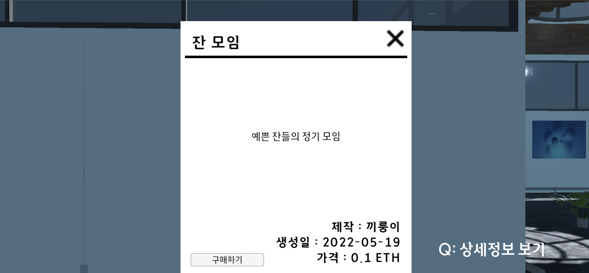

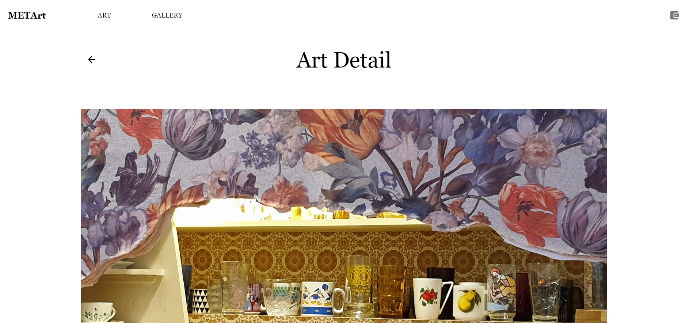
